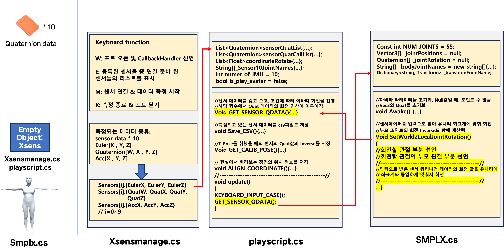
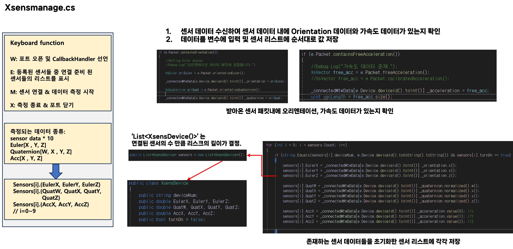
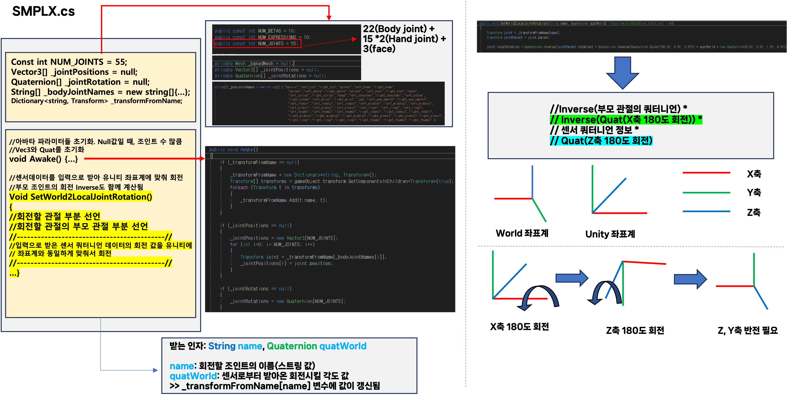

# IMU 센서를 활용한 3D Pose estimation

## 프로젝트 요약

* IMU 센서를 사용자의 신체에 부착하고 움직일 때의 정보를 취득한 후 3D 아바타에 움직임 정보를 전달하여 실시간으로 움직임을 트래킹 하는 시스템.
* 10개의 IMU 센서(Xsens AWINDA)를 활용, 아바타로는 SMPL-X 모델을 활용했으며 Unity3D 환경에서 스크립트를 통하여 제어.

### Pipeline

* XsensMaange.cs: 유니티와 하드웨어 센서의 연결 후 데이터 수신 및 갱신을 진행.
* Playscript.cs: 수신된 센서데이터를 이용하여 아바타의 관절 회전 값을 정의하고, Heading Reset, T-pose calibration을 통해 아바타의 포즈 추정에 필요한 최종 회전 값을 계산 및 전달.
* SMPLX.cs(기존 파일 일부 수정): 아바타에 대한 관절인덱스 정보 및 회전 정보를 아바타에 적용.

 

프로젝트 코드의 흐름.

### Xsensmanage.cs

### playscript.cs

### SMPLX.cs

### Others...
* LiDAR 센서를 이용한 위치 추정은 센서 펌웨어 업데이트로 동작하지 않음(24.07~)) + 유니티 3D가 아닌 VTK를 이용한 다른 C++기반 프로젝트로 별개 프로젝트로 관리. 따라서 본 프로젝트의 구현 부분만 설명.

* 끝 관절(손목, 발목, 목, 머리)등은 센서 미부착으로 인해 관절 변화가 트래킹 되지 않음. 추가적인 센서를 달거나 다른 종류의 센서들(장갑, 헬멧)을 연결해 해결 가능하지만 연구실에서 예산문제로 센서 확보가 어려워 진행하지 않음.